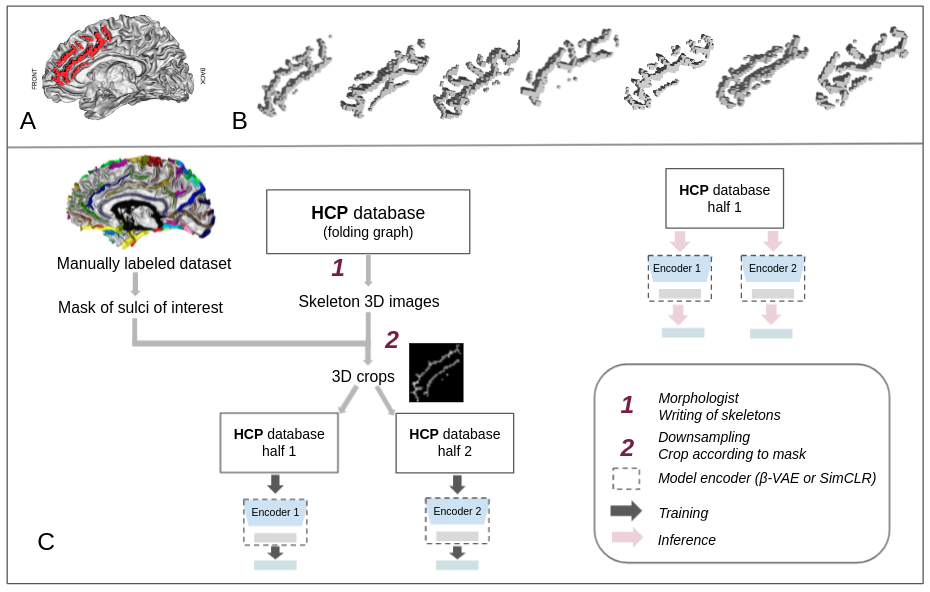
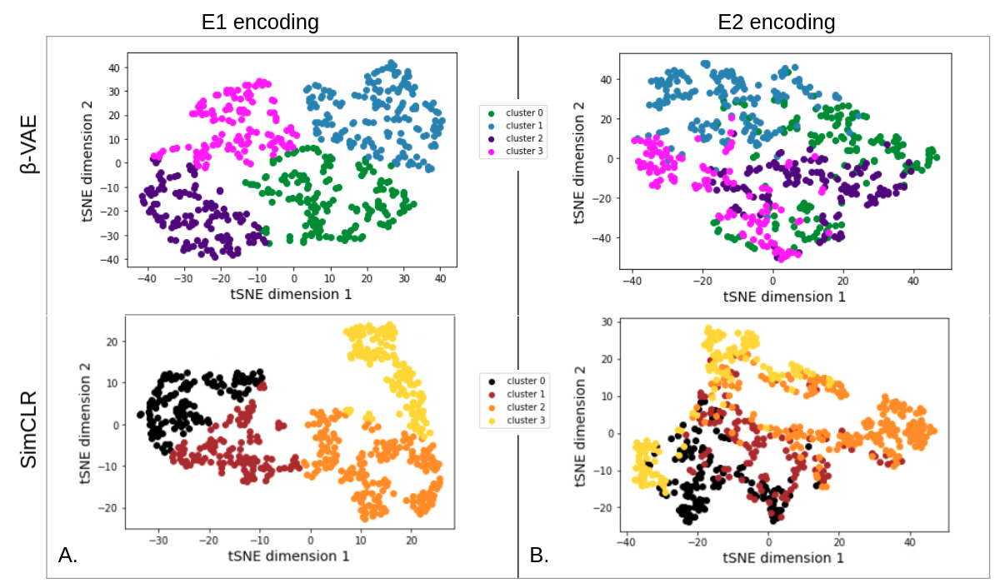
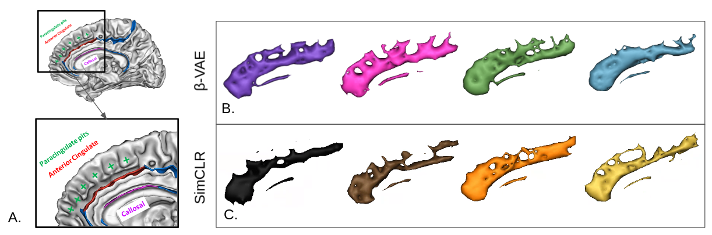

Unsupervised Representation Learning of Cingulate Cortical Folding Patterns
------------

Official Pytorch implementation for `Unsupervised Learning and Cortical Folding paper <https://openreview.net/forum?id=ueRZzvQ_K6u>`_.
The project aims to study cortical folding patterns thanks to unsupervised deep learning methods.

Dependencies
-----------
- python >= 3.6
- pytorch >= 1.4.0
- numpy >= 1.16.6
- pandas >= 0.23.3

Installation
------------

We first install the singularity brainvisa image following https://brainvisa.info/web/download.html

We then enter the brainvisa environment:

.. code-block:: shell

    bv opengl=nv bash
    
We can use a virtual environment:

.. code-block:: shell

    virtualenv --python=python3 --system-site-packages venv
    . venv/bin/activate
    
We then download and install the present deep learning package:

.. code-block:: shell

    git clone https://github.com/neurospin-projects/2021_jchavas_lguillon_deepcingulate
    cd 2021_jchavas_lguillon_deepcingulate
    pip3 install -e .
    
Training the models
-------------------
Data are available in <data/>`_ directory.
To train and evaluate each model, we follow the corresponding README:
    * `README of beta-VAE model <betaVAE/readme.md>`_
    * `README of SimCLR model <SimCLR/README.rst>`_
